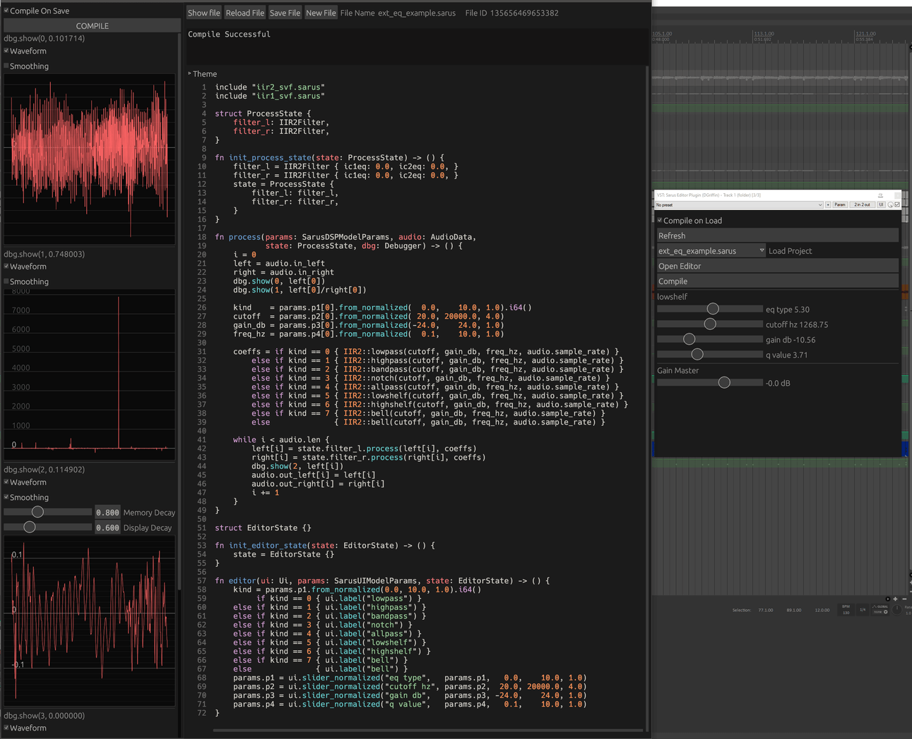

# sarus-editor-plugin
Sarus editor in a DAW plugin

This plugin is in very early stages of development.



Build with `cargo build --release`

The plugin uses locates project files & logs in the user folder:
```
  Linux: /home/alice/.config/Sarus/EditorPlugin
Windows: C:\Users\Alice\AppData\Roaming\Sarus\EditorPlugin
  MacOS: /Users/Alice/Library/Application Support/Sarus/EditorPlugin
```